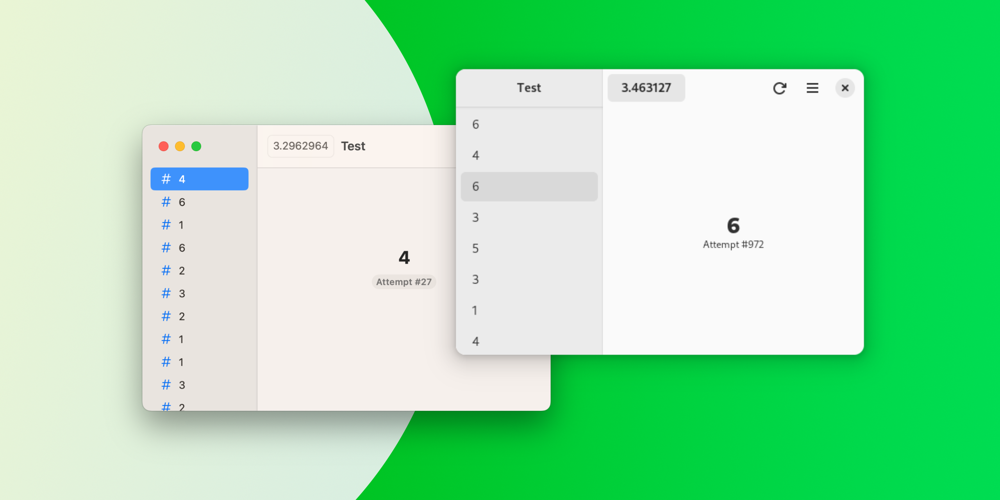

> [!NOTE]
> This project is no longer maintained.
> I'm working on a declarative framework as an alternative.

<p align="center">
  
  <h1 align="center">Dvandva</h1>
</p>

<p align="center">
  <a href="https://github.com/david-swift/Dvandva">
  GitHub
  </a>
  ·
  <a href="Documentation/Reference/README.md">
  Contributor Docs
  </a>
</p>

_Dvandva_ is a framework for creating user interfaces for GNOME and macOS with one shared code.



## Table of Contents

- [Goals](#Goals)
- [Installation](#Installation)
- [Usage](#Usage)
- [Thanks](#Thanks)

## Goals

_Dvandva_’s goal is not to provide bindings for every widget on both platforms, but to make the creation of cross-platform apps easier. It’s always possible to add any widget to an app using the `NativeWrapper` widget.

If you find yourself using `NativeWrapper` for a widget that is available on both platforms in a similar form, consider opening an issue [here](https://github.com/david-swift/Dvandva/issues).

## Installation
### Dependencies
If you are using a Linux distribution, install `libadwaita-devel` or `libadwaita` (or something similar, based on the package manager) as well as `gtk4-devel`, `gtk4` or similar.

On macOS, I recommend installing [Swift Bundler](https://github.com/stackotter/swift-bundler?tab=readme-ov-file#installation-).

### Swift Package
1. Open your Swift package in GNOME Builder, Xcode, or any other IDE.
2. Open the `Package.swift` file.
3. Into the `Package` initializer, under `dependencies`, paste:
```swift
.package(url: "https://github.com/david-swift/Dvandva", from: "0.1.0")   
```

## Usage

Create an executable target in the Swift package and add the following code:
```swift
import Dvandva

let app = Application("AppName", version: "0.1.0", id: "id.for.Gnome", developer: "Developer")

app.run {
    let window = Window(id: "main", app: app)
    window.setChild(
        PaddingWrapper(
            Label().setText("Hello, world!")
        )
        .setPadding(20)
    )
    window.show()
}
```

Now, you can modify the windows. Take a look at the [sample app](Tests/main.swift) and the [docs](Documentation/Reference/README.md) for help.

### Run the App
On macOS, I recommend using [Swift Bundler](https://github.com/stackotter/swift-bundler) for building the app. When building the app simply with `swift run`, the menu bar and therefore keyboard shortcuts are not supported.

On Linux, you can simply use `swift run`. In certain scenarios, setting up a Flatpak with the [Swift extension](https://github.com/david-swift/org.freedesktop.Sdk.Extension.swift) may be sensible. [This tutorial](https://docs.flatpak.org/en/latest/getting-started.html) is very helpful.

## Thanks

### Dependencies
- [Libadwaita](https://github.com/AparokshaUI/Libadwaita) licensed under the [GPL-3.0 license](https://github.com/AparokshaUI/Libadwaita/blob/main/LICENSE.md)

### Other Thanks
- The [contributors](Contributors.md)
- [SwiftLint](https://github.com/realm/SwiftLint) for checking whether code style conventions are violated
- The programming language [Swift](https://github.com/apple/swift)
- [SourceDocs](https://github.com/SourceDocs/SourceDocs) used for generating the [docs](Documentation/Reference/README.md)
- [AppKit](https://developer.apple.com/documentation/appkit/#) and [Libadwaita](https://gitlab.gnome.org/GNOME/libadwaita) for the widgets
